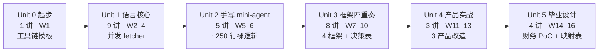

# py-night-school —— Python 夜校

[](./LICENSE)
[](https://github.com/yq3/py-night-school/actions/workflows/course-verify.yml)
[](https://yq3.github.io/py-night-school/)
[](./CURRICULUM.md)

> 写给 Java 工程师的 Python Agent 开发晚课：**以 agent 开发为场景学 Python，以 Java 心智模型为桥**。标准 16 周、30 讲，最终完成一个金融合规 agent 毕业设计。

**在线阅读**：[点击此处阅览](https://yq3.github.io/py-night-school/)；练习和验收请克隆本仓库。

## 快速开始：零 key 跑通一个 Agent

想先确认课程能运行，可以用 Unit 2.3 的离线剧本模型跑一个完整的 ReAct 工具循环，无需 API key。

先安装 [uv](https://docs.astral.sh/uv/)。它负责创建环境、安装锁定依赖和运行课程命令：

```bash
# macOS / Linux
curl -LsSf https://astral.sh/uv/install.sh | sh
```

```powershell
# Windows PowerShell
powershell -ExecutionPolicy ByPass -c "irm https://astral.sh/uv/install.ps1 | iex"
```

重新打开终端并确认：

```bash
uv --version
```

```bash
git clone https://github.com/yq3/py-night-school.git
cd py-night-school/units/unit2-mini-agent/L2.3-react-loop
uv sync
uv run python code/demo_agent.py
```

Windows PowerShell 逐行执行即可。实测输出（节选）——查报销单 → 调用预审工具 → 带原因拒绝：

```text
     user: 请审查报销单 CLM-2026-0003。
assistant: [选了工具: get_claim]
     tool: {"id": "CLM-2026-0003", "submitter": "赵工", "pu  (id=call_001)
assistant: [选了工具: preapprove]
     tool: REJECT:INVALID_AMOUNT  (id=call_002)

 最终回答: REJECT:INVALID_AMOUNT（报销单含负数金额明细，属脏数据）。
```

按目标选择入口：

- **系统学习**：从 [Unit 0 第一课](./units/unit0-toolchain/L0.1-uv-toolchain/README.md)开始；已有 Python 基础可先读 Unit 2。
- **查看产物**：阅读 [Unit 5 毕业 PoC](./units/unit5-capstone/milestone/README.md) 和 [Python↔Java 架构映射表](./units/unit5-capstone/milestone/JAVA-MAPPING.md)。

## 为什么需要这个教程

2026 年的 agent 开发生态，Python 侧最火热，但现有教程对 Java 工程师都不友好：

- **Agent 教程默认你会 Python**：HuggingFace Agents Course 前置要求 "Basic knowledge of Python"，微软课程直接上框架代码——Java 工程师卡在第一公里。
- **Python 教程不碰 agent**：「Python for Java Developers」类资源零散且通用（爬虫/脚本案例），学完离 agent 开发还差一半。
- **调研的主流教程里，没有一份以 Java 心智模型为桥**：装饰器像注解但不是注解、asyncio 像虚拟线程但语义完全不同、Pydantic 像 bean 但职责更重——这些「似是而非」正是迁移期最大的事故源，值得逐个讲透。

本教程填这个空档。

## 招生对象：适合谁 / 不适合谁

**适合**：
- 主力语言是 Java（或 Kotlin/C# 等同类静态类型 OO 语言），Python 只是略懂；
- 想进入 agent 开发领域，希望「学一门语言」和「学一个领域」一次完成；
- 最好对 Spring 生态有体感——教程里的对照表按 Spring/Maven/JUC 习惯展开。

**不适合**（诚实声明）：
- Python 已熟练的工程师 → 直接去读各框架官方文档更快；
- 零编程基础 → 先补任意 Python 入门课；
- 想学 LLM 原理 / 微调 / Transformer → 见下方「延伸阅读」。

## 课程特色

1. **Java 心智桥**：概念先给 Java 对照和关键差异；陷阱按「现象 / 复现 / 直觉为何失效 / 修复」拆解。
2. **练习即测试**：每课 TODO 由 `pytest`、`ruff`、`pyright` 验收，hints 渐进提示，答案分离。
3. **对照组教学法**：Unit 2 先手写 ~250 行 mini-agent，之后每个框架课都回来对照「这层抽象替我付掉了什么」，以 OpenAI cookbook 的无框架官方实现为对照原件。
4. **源码路标**：每课延伸给出 `仓库@commit#路径` 精确导读——学框架同时学读生产级 Python 源码（转岗后的隐性门槛）。我们不自研玩具框架，该路线 hello-agents 第七章已做得很好。
5. **双贯穿线 + 金融毕业设计**：明线「报销单审查」从第一课种下、四大框架同题重做；暗线财务 agent 毕业设计每课长一块（审批外化 / 事件溯源 / fail-closed 执行门），结业另产出 Python↔Java 架构映射表。
6. **工程纪律**：中文原创、端点中立、依赖锁定、源码路标锚定 commit，课程验证 CI 持续检查。

## 课表

| 单元 | 主题 | 课时 | 里程碑产物 |
|---|---|---|---|
| 0 | 起步：工具链一次到位 | 1 | uv 项目模板（pytest/ruff/pyright 全绿） |
| 1 | Python 语言核心·Java 对照 | 9 | 练习集；能不查资料手写 async 并发 fetcher + retry 装饰器 |
| 2 | 无框架手写 mini-agent | 5 | ~250 行 mini-agent（工具循环+流式+结构化输出+MCP） |
| 3 | 框架四重奏 | 8 | 4 框架同题 demo + 对照笔记 + 决策表 |
| 4 | 开源产品实战 | 3 | 3 个产品的机制抽取与改造（零 key 可验收；真跑产品属可选加餐） |
| 5 | 毕业设计：财务 agent | 4 | 合规骨架 PoC + Python↔Java 架构映射表 |

标准节奏下的学习路径：



合计 30 讲，另有 5 个里程碑；标准节奏每周约 6–8 小时。

完整大纲（含每课时明细、练习机制、节奏建议）：[CURRICULUM.md](./CURRICULUM.md)

## 入学指南

- **环境**：安装 [uv](https://docs.astral.sh/uv/)，每课是独立可运行的项目；平台差异见 Unit 0。
- **模型端点中立**：任何 OpenAI 兼容端点均可（GLM / DeepSeek / Qwen / OpenAI / 本地 vLLM）。需要真实模型时，在对应课时目录复制 `.env.example` 为 `.env` 并填写：

  ```dotenv
  OPENAI_BASE_URL=https://your-endpoint.example/v1
  OPENAI_API_KEY=your-key
  MODEL_NAME=your-model
  ```

  Unit 0–2 的离线练习和验收不需要 API key。
- **练习即测试**：每课 `exercises/` 提供带 TODO 的练习文件，`uv run pytest`、`uv run ruff check .`、`uv run pyright` 三命令全绿即完成本课（rustlings 式验收，Java 同学可以理解为 Exercism 模式）——完成判据全课统一，见各课 §1。
- **节奏**：标准节奏每周 6–8 小时、约 16 周走完；紧凑节奏 8–10 周。也可以只走主干（见 CURRICULUM「调节旋钮」）。

## 延伸阅读

通用内容可参考：

- LLM / 智能体基础理论 → [hello-agents](https://github.com/datawhalechina/hello-agents)（Datawhale，中文，16 章大部头）
- MCP 协议深入 → [microsoft/mcp-for-beginners](https://github.com/microsoft/mcp-for-beginners)（六语言）
- 微软系框架全景 → [microsoft/ai-agents-for-beginners](https://github.com/microsoft/ai-agents-for-beginners)（18 课）
- smolagents / LlamaIndex 视角 + GAIA 结业挑战 → [HuggingFace Agents Course](https://github.com/huggingface/agents-course)
- 各框架官方课（LangGraph 等）→ LangChain Academy / DeepLearning.AI 短课

## 工程说明

- 课程验证 CI（[course-verify](./.github/workflows/course-verify.yml)）随每次 push 公开运行：结构校验 `check_lesson` 全量 + 关键路径三态验证（L0.1 / L2.3 / Unit 5 里程碑）；全量三态（30 课时 + 5 里程碑）本地跑：`python3 scripts/three_state_check.py`。
- 状态与后续计划见 [ROADMAP.md](./ROADMAP.md)；对外文章见 [articles/](./articles/)。
- 工作规范见 [AGENTS.md](./AGENTS.md)；在线阅读站由 [handbook/](./handbook/) 构建。
- 教程中引用的框架仓库按各自协议归属原作者。
- License：[MIT](./LICENSE)。
